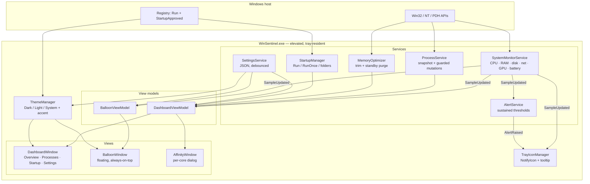
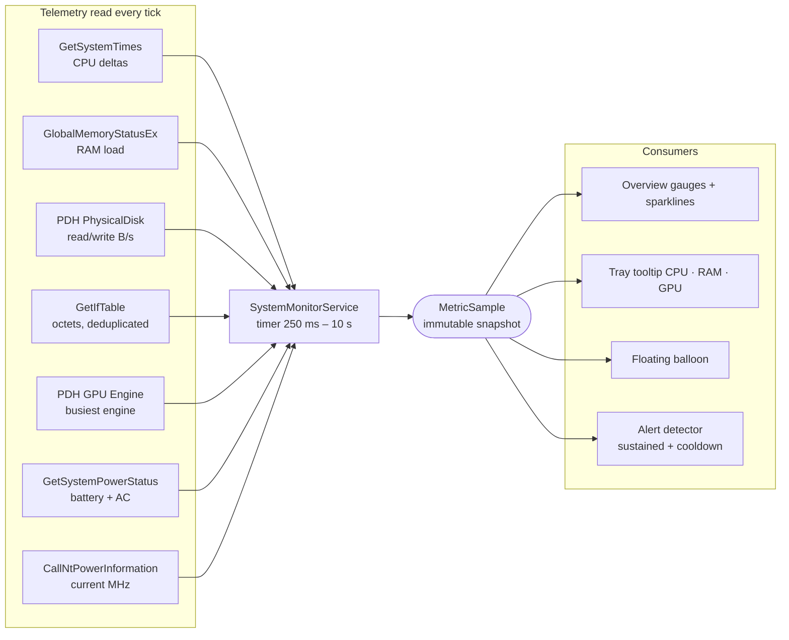
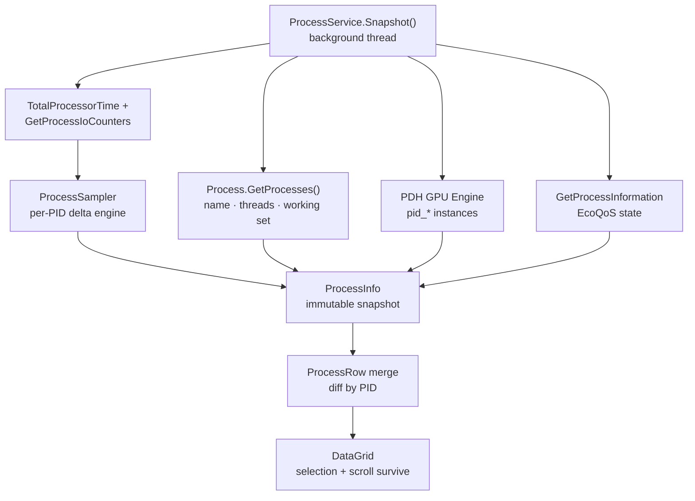
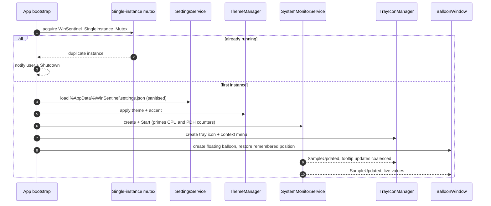
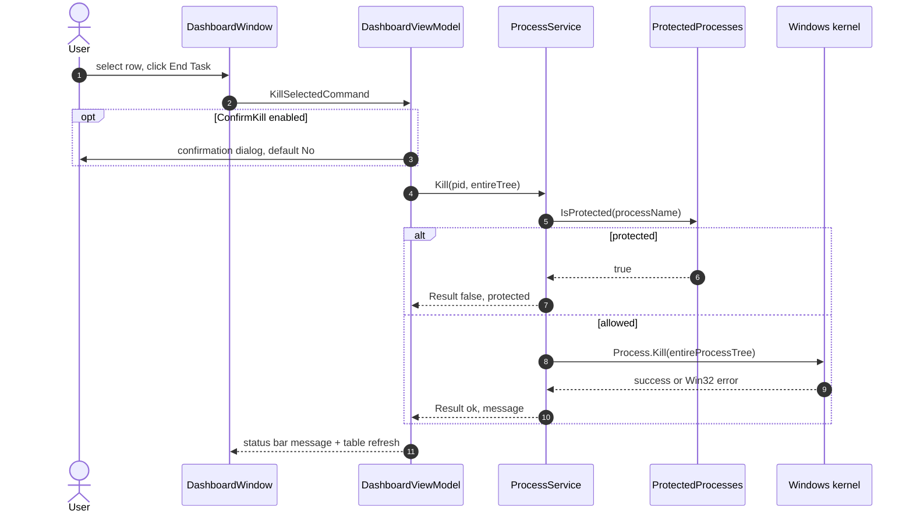
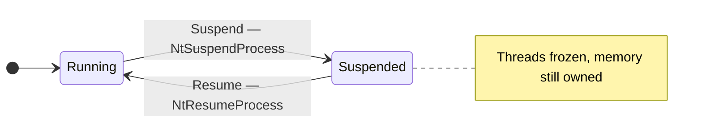
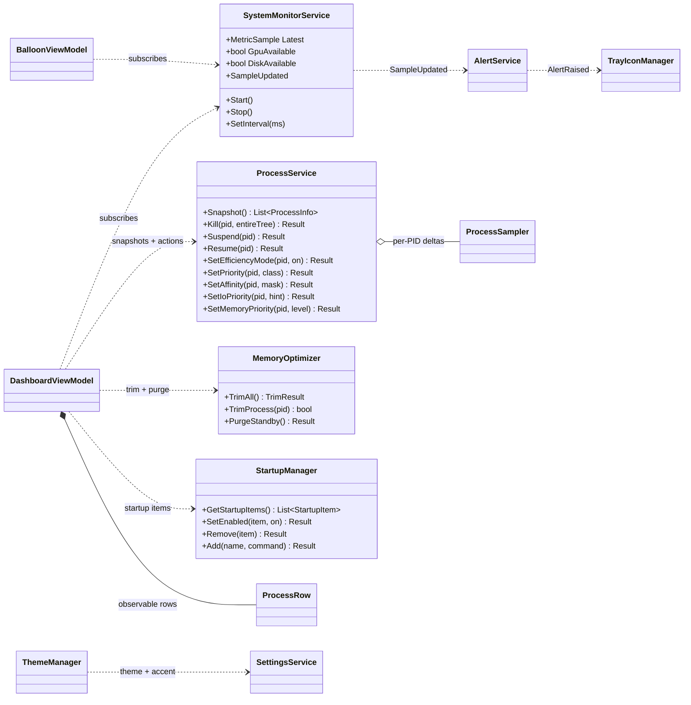
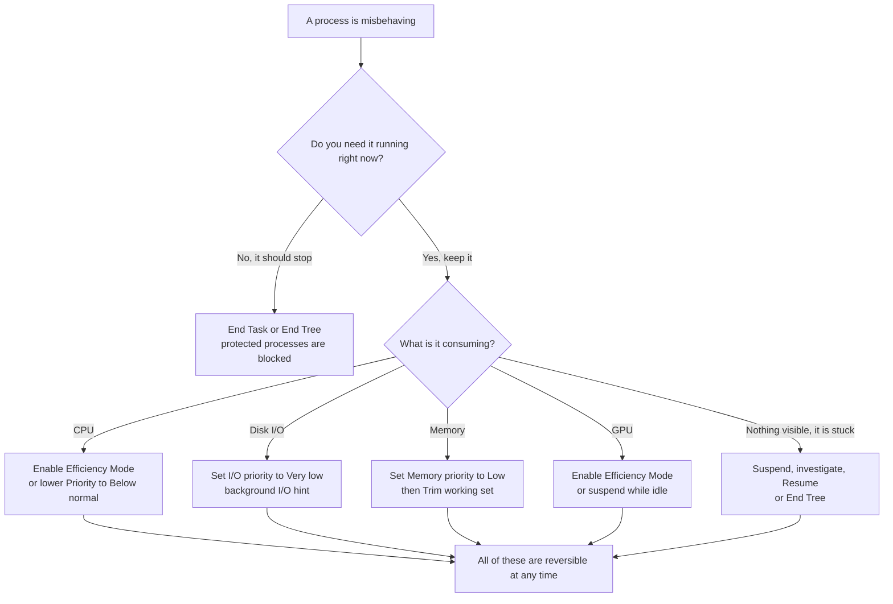
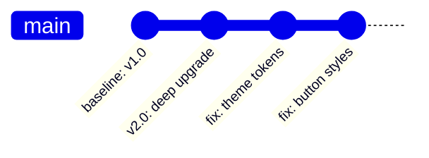

<div align="center">


# WinSentinel

**Floating system monitor & optimizer for Windows 10 / 11**

A lightweight, always-on-top "accessibility balloon" that lives in the system tray, shows live
CPU / RAM / GPU / disk / network, and gives you Task-Manager-grade control over processes, memory
working sets, CPU priority/affinity, Windows Efficiency Mode, I/O and memory priorities, and
startup programs — wrapped in a themed WPF dashboard.

<br/>


[Features](#features) · [Architecture](#architecture) · [How it works](#how-it-works) · [Build & run](#build-and-run) · [Usage](#usage) · [Safety](#safety-model) · [Troubleshooting](#troubleshooting)

</div>

---

> [!NOTE]
> **WinSentinel 2.0** is a deep upgrade of the original tray widget: per-process CPU / disk / GPU,
> Efficiency Mode, suspend/resume, I/O + memory priorities, full startup management, themes,
> alerts, and a retarget to **.NET 10 LTS** (.NET 8 reached end of support 2026-11-10).
> Everything below is verified against the source tree at commit `0b3e86a` (v2.0.0).

<details>
<summary><strong>What's new in 2.0 — at a glance</strong> (click to expand)</summary>

| Area | Added |
|------|-------|
| **Metrics** | Per-process **CPU %**, **disk I/O rate**, **GPU %** (PDH `GPU Engine`, busiest-engine convention), **Efficiency-Mode state**; system **disk throughput** (PDH `PhysicalDisk`), **network up/down** (`GetIfTable`, alias-deduplicated), **GPU total**, **battery/AC**, **CPU clock MHz** (`CallNtPowerInformation`) |
| **Process control** | **Efficiency Mode (EcoQoS)** toggle, **Suspend / Resume** (`NtSuspendProcess`), **End process tree**, **I/O priority**, **Memory priority** — all behind the protected-process guard rail |
| **Memory** | Working-set trim (single / all, honest about page-back) + advanced **standby-list purge** (`NtSetSystemInformation`), each with real trade-off text |
| **Startup** | Run + **RunOnce** + **Startup folders** (user & all-users), **Enable/Disable** via Explorer's `StartupApproved` keys (non-destructive), plus add/remove for HKCU |
| **UX** | **Dark / Light / System themes + 7 accent choices** (live swap), sidebar navigation (Task-Manager-style), 4 live gauges + auto-scaling sparklines, searchable **auto-refreshing process table** (paused at will), row-accurate diffing (selection survives refresh), context menus, keyboard shortcuts, upgraded balloon (opacity, remembered position, optional GPU/disk/net rows, right-click actions), richer tray menu |
| **Reliability** | Crash handlers + log file, settings persistence (`%AppData%\WinSentinel\settings.json`), resource-hog alerts with cooldown, fixed event-handler leak, background snapshots (UI never blocks), thread-safe tray updates, affinity-mask bug fix |
| **Platform** | Retargeted to **.NET 10 LTS** |

</details>

---

## Table of contents

- [Features](#features)
- [Capability matrix](#capability-matrix)
- [Architecture](#architecture)
  - [Component map](#component-map) · [Runtime data flow](#runtime-data-flow) · [Per-process pipeline](#per-process-pipeline)
  - [Startup sequence](#startup-sequence) · [Guarded action flow](#guarded-action-flow) · [Suspend lifecycle](#suspend-lifecycle)
  - [Service topology](#service-topology) · [Choosing the right action](#choosing-the-right-action)
- [Tech stack](#tech-stack)
- [Requirements](#requirements)
- [Project layout](#project-layout)
- [How it works](#how-it-works)
- [Build and run](#build-and-run)
- [Usage](#usage)
  - [Keyboard shortcuts](#keyboard-shortcuts) · [The floating balloon](#the-floating-balloon) · [The tray menu](#the-tray-menu)
- [Safety model](#safety-model)
- [Performance and footprint](#performance-and-footprint)
- [Settings and log files](#settings-and-log-files)
- [Troubleshooting](#troubleshooting)
- [Extending](#extending)
- [Roadmap](#roadmap)
- [License](#license)

---

## Features

### Feature map

```text
WinSentinel
├── Floating Balloon         Always-on-top, frameless, translucent, draggable,
│                            position remembered, opacity control. CPU + RAM +
│                            optional GPU/disk/net rows. Right-click quick actions.
│                            Double-click → Dashboard.
├── System Tray              NotifyIcon tooltip (CPU/RAM/GPU), context menu:
│                            Open · Show Balloon · Trim · Purge standby ·
│                            Alerts toggle · Settings · Exit.
├── Alerts                   Sustained CPU/RAM thresholds → tray notification,
│                            rate-limited, never changes system state.
└── Dashboard (sidebar nav)
    ├── Overview             4 live gauges (CPU/RAM/GPU + disk activity),
    │                        auto-scaling sparklines, network down/up graphs,
    │                        battery + uptime + clock detail, memory tuning card.
    ├── Processes            Searchable, auto-refreshing table: CPU %, memory,
    │                        disk rate, GPU %, threads, priority, ECO chip,
    │                        suspended state. Per-process actions:
    │                          • End Task / End Tree       — confirmations + guard rail
    │                          • Suspend / Resume         — NtSuspendProcess
    │                          • Efficiency Mode          — EcoQoS toggle
    │                          • Trim Working Set         — EmptyWorkingSet
    │                          • Priority                 — Idle … RealTime (guarded)
    │                          • CPU Affinity             — per-core dialog
    │                          • I/O priority             — Very low / Low / Normal
    │                          • Memory priority          — Very low … Normal
    │                          • Open file location / Copy details
    ├── Startup              HKCU/HKLM Run + RunOnce + Startup folders, with
    │                        enable/disable (StartupApproved), add, remove (HKCU).
    └── Settings             Theme + accent, sampling cadences, balloon options,
                             alert thresholds, safety confirmations, about/reset.
```

### Live telemetry

| Metric | Where it shows | Source |
|--------|----------------|--------|
| System CPU % | Overview gauge + sparkline, tray tooltip, balloon | `GetSystemTimes` deltas |
| RAM load / used / total / free | Overview gauge + sparkline | `GlobalMemoryStatusEx` |
| CPU clock (average MHz) | Overview detail line | `CallNtPowerInformation(ProcessorInformation)` |
| Disk read / write throughput | Overview card + auto-scaling sparkline | PDH `\PhysicalDisk(_Total)` |
| Network down / up | Overview card + sparklines | `GetIfTable` (loopback excluded, aliases collapsed) |
| GPU % (busiest engine) | Overview gauge + per-process column | PDH `\GPU Engine(*)` |
| Battery % + AC state | Overview card (only when a battery exists) | `GetSystemPowerStatus` |
| Per-process CPU / disk / GPU, threads, priority, ECO state | Processes table (searchable) | Process API + PDH + `GetProcessInformation` |

### Process control

All mutations route through `ProcessService`, which **re-checks the protected-process list inside
every call** — the guard rail lives below the UI, not in it.

- **End Task** / **End Tree** — with configurable confirmation dialogs
- **Suspend / Resume** — `NtSuspendProcess` / `NtResumeProcess` (the same calls behind Resource Monitor)
- **Efficiency Mode (EcoQoS)** — the Windows 11 Task Manager toggle, on Windows 10 too
- **CPU priority** — Idle → RealTime (RealTime asks a second confirmation)
- **CPU affinity** — per-core dialog, at least one core enforced
- **I/O priority** — Very low / Low / Normal (`NtSetInformationProcess` = 33)
- **Memory priority** — Very low → Normal (`SetProcessInformation(ProcessMemoryPriority)`)
- **Trim working set** — single process or all (`EmptyWorkingSet`)
- **Open file location**, **Copy details** — clipboard-ready process report

### Memory tuning

- **Trim working sets** for every accessible, non-protected process; reports how many were trimmed
  and an honest best-effort "reclaimed" figure.
- **Standby-list purge** (advanced, admin-only) via `NtSetSystemInformation` — labeled in the UI for
  what it is: a cache flush that Windows immediately rebuilds from disk with a brief I/O spike.

### Startup manager

Scans **all four** places Windows starts programs from — HKCU/HKLM `Run`, HKCU/HKLM `RunOnce`, and
the per-user / all-users Startup folders — and merges Explorer's `StartupApproved` state.

- **Enable / Disable** without deleting anything (per-user entries, including user Startup-folder files)
- **Remove** HKCU `Run` / `RunOnce` entries (confirmation shown with the exact registry path)
- **Add** a new HKCU `Run` entry
- HKLM entries are surfaced for visibility and **never modified**

### Experience

- Floating balloon: always-on-top, frameless, translucent, **draggable with remembered position**
  (clamped into the current virtual screen), opacity slider, optional GPU / disk / network rows,
  right-click quick actions, double-click → dashboard.
- Dashboard: sidebar-style navigation — Overview, Processes, Startup, Settings.
- **Themes**: Dark / Light / System + accents Cyan, Blue, Violet, Green, Orange, Rose, System
  (reads the real Windows accent + app-theme and re-applies live).
- Configurable sampling cadence (500 / 1000 / 2000 ms) and process refresh (1 / 2 / 5 / 10 s), with
  a **Pause** switch and a filter that matches name, PID or publisher.
- Sustained-threshold **alerts** with cooldown — informational only, they never change system state.

### Reliability and safety

- Single-instance mutex; closing windows hides them, only tray Exit quits.
- Crash handlers on UI thread, background threads and unobserved tasks → append-only log that
  self-trims at 512 KB and never throws.
- Settings are sanitized on load and saved debounced (slider drags don't hammer the disk).
- Snapshots run off the UI thread; the process table diffs by PID, so selection, sorting and scroll
  survive refreshes.

---

## Capability matrix

| Capability | Where it surfaces | Backing API |
|------------|-------------------|-------------|
| System CPU % | Overview gauge / sparkline | `GetSystemTimes` deltas |
| System RAM % + detail | Overview gauge / sparkline | `GlobalMemoryStatusEx` |
| Disk throughput (R/W) | Overview card | PDH `PhysicalDisk(_Total)` |
| Network ↓/↑ | Overview card | `GetIfTable` octet counters |
| GPU % (system + per process) | Overview + table | PDH `GPU Engine(*)\Utilization Percentage` |
| Battery / AC | Overview card | `GetSystemPowerStatus` |
| CPU clock MHz | Overview detail | `CallNtPowerInformation` |
| Per-process CPU % | Table (CPU column) | `TotalProcessorTime` deltas ÷ logical cores |
| Per-process disk rate | Table (Disk column) | `GetProcessIoCounters` deltas |
| End task / end tree | Toolbar + context menu | `Process.Kill(entireProcessTree)` |
| Suspend / resume | Toolbar | `NtSuspendProcess` / `NtResumeProcess` |
| Efficiency Mode (EcoQoS) | Toolbar + ECO chip | `SetProcessInformation(ProcessPowerThrottling)` |
| CPU priority | Toolbar combo | `Process.PriorityClass` |
| CPU affinity | Modal dialog | `ProcessorAffinity` bitmask |
| I/O priority | Toolbar combo | `NtSetInformationProcess(33)` |
| Memory priority | Toolbar combo | `SetProcessInformation(ProcessMemoryPriority)` |
| Trim working set | Toolbar + tray + Overview | `EmptyWorkingSet` (psapi) |
| Standby purge | Overview + tray | `NtSetSystemInformation(SystemMemoryListInformation)` |
| Startup scan / toggle / add / remove | Startup tab | Registry `Run`, `RunOnce`, `StartupApproved`, Startup folders |
| Resource alerts | Tray balloon | `AlertService` sustained thresholds |
| Themes / accents | Settings tab | Runtime dictionary swap + DWM registry |

---

## Architecture

### Component map



### Runtime data flow



### Per-process pipeline



### Startup sequence



### Guarded action flow

Every destructive action passes through the same funnel — shown here for **End Task**; suspend,
priority, I/O, memory priority and trims follow the identical pattern.



### Suspend lifecycle



Efficiency Mode, CPU priority, I/O priority, memory priority and affinity are **independent flags**,
not states — they can be applied at any time, including while suspended, and are all reversible.

### Service topology



### Choosing the right action



### Version history



---

## Tech stack

| Layer | Choice | Notes |
|-------|--------|-------|
| Language | C# (`LangVersion=latest`) | Nullable + implicit usings enabled |
| Runtime | .NET 10 (`net10.0-windows`) | LTS; upgraded from .NET 8 |
| UI | WPF (XAML) + MVVM | Hand-rolled `ViewModelBase` + `RelayCommand`, no MVVM framework |
| Tray | WinForms `NotifyIcon` | The only WinForms file: `TrayIconManager.cs`; implicit WinForms usings removed project-wide |
| Charts | Custom controls | `CircularGauge`, `Sparkline` — owner-drawn in `OnRender`, zero dependencies |
| Interop | P/Invoke | kernel32 · psapi · ntdll · powrprof · iphlpapi · pdh — all declared in one file |
| Settings | `System.Text.Json` | Debounced save, sanitized load |
| Packaging | Single-file self-contained publish | `PublishSingleFile` + `IncludeNativeLibrariesForSelfExtract` |

---

## Requirements

| Component | Requirement | Notes |
|-----------|-------------|-------|
| OS | Windows 10 1809+ / Windows 11 | Matches the `supportedOS` manifest declaration |
| Runtime | .NET 10 Desktop Runtime | Not needed with self-contained publish |
| Privileges | Administrator (UAC) | `requireAdministrator` in `app.manifest` — needed to read and act on every process |
| GPU metrics | Windows 10 1709+, WDDM 2.0+ driver | GPU Engine counters simply do not exist on some VMs/drivers; the UI hides them honestly |
| Efficiency Mode | Windows 10 / 11 | On Win10 the state is *set-only* (see [How it works](#how-it-works)) |
| Standby purge | Administrator | `SeProfileSingleProcessPrivilege` |
| Architecture | x64 / AnyCPU | Both solution platforms supported |

---

## Project layout

```text
WinSentinel/
├── WinSentinel.sln
├── README.md
├── .gitignore
└── src/
    └── WinSentinel/
        ├── WinSentinel.csproj           net10.0-windows · WinExe · v2.0.0
        ├── app.manifest                 requireAdministrator + PerMonitorV2 DPI + longPathAware
        ├── App.xaml / App.xaml.cs       Bootstrap: settings → theme → services → tray/balloon
        ├── Assets/                      app.ico · tray.ico · logo.png
        ├── Themes/
        │   ├── Shared.xaml              Fonts + all control styles (theme-agnostic)
        │   ├── Dark.xaml                Dark colour tokens
        │   └── Light.xaml               Light colour tokens
        ├── Models/
        │   ├── MetricSample.cs          Immutable system snapshot
        │   ├── ProcessInfo.cs           Immutable process snapshot (CPU/disk/GPU/eco aware)
        │   ├── StartupItem.cs           Startup entry (+ StartupApproved state)
        │   └── AppSettings.cs           Persisted user settings (all defaulted)
        ├── Services/
        │   ├── NativeMethods.cs         All P/Invoke declarations (single interop surface)
        │   ├── PdhHelper.cs             PDH wrapper: GPU Engine + PhysicalDisk counters
        │   ├── SystemMonitorService.cs  CPU/RAM/disk/net/GPU/battery/clock sampling
        │   ├── ProcessService.cs        Snapshot + all guarded mutations
        │   ├── ProcessSampler.cs        Delta engine for per-process rates
        │   ├── MemoryOptimizer.cs       Trim all / single, standby purge
        │   ├── StartupManager.cs        Run/RunOnce/folders + enable/disable/add/remove
        │   ├── AlertService.cs          Sustained CPU/RAM alert detector
        │   ├── SettingsService.cs       JSON settings (debounced save, sanitised load)
        │   ├── ProtectedProcesses.cs    OS-critical denylist (service-layer enforced)
        │   └── Logger.cs                Crash/diagnostic log (self-trimming, never throws)
        ├── ViewModels/
        │   ├── ViewModelBase.cs         INotifyPropertyChanged base
        │   ├── RelayCommand.cs          ICommand relay (CommandManager requery)
        │   ├── ProcessRow.cs            In-place-updated table row VM + search matching
        │   ├── BalloonViewModel.cs      Balloon data + visibility/opacity/position
        │   └── DashboardViewModel.cs    Gauges, table, startup, settings surface
        ├── Controls/
        │   ├── CircularGauge.cs         Owner-drawn arc gauge (no dependencies)
        │   └── Sparkline.cs             Owner-drawn real-time line graph
        ├── Converters/Converters.cs     Protected→brush, bool→visibility, startup state
        ├── Helpers/
        │   ├── ThemeManager.cs          Runtime theme/accent swapping + system theme watch
        │   └── TrayIconManager.cs       NotifyIcon owner (only WinForms file)
        └── Views/
            ├── BalloonWindow.xaml(.cs)   The floating balloon
            ├── DashboardWindow.xaml(.cs) Sidebar dashboard (4 pages)
            └── AffinityWindow.xaml(.cs)  Per-core affinity dialog
```

---

## How it works

Technical notes for the curious — every method below is the one actually used in the source.

### CPU — `GetSystemTimes` deltas

`busy% = (kernelΔ + userΔ − idleΔ) / (kernelΔ + userΔ) × 100` (kernel time already includes idle).
No `PerformanceCounter` pitfalls: no first-read zero, no counter-DB corruption, no locale issues.

### Memory — `GlobalMemoryStatusEx`

Physical load / used / available come straight from `MEMORYSTATUSEX`, matching Task Manager's
"In use" figure. `CpuMhz` comes from `CallNtPowerInformation(ProcessorInformation)` averaged across
logical processors; firmware that doesn't report it degrades to "not shown".

### Per-process metrics

- **CPU %** — `TotalProcessorTime` deltas, normalised to total capacity
  (`Δcpu / (Δt × logicalCores)`), the Task Manager convention: one full core on an 8-core machine
  reads 12.5%.
- **Disk rate** — `GetProcessIoCounters` deltas. Documented caveat: Windows aggregates file +
  network + device I/O in this counter.
- **GPU %** — PDH `\GPU Engine(*)\Utilization Percentage`; instance names parsed (`pid_…_engtype_…`).
  Per-process value = **busiest engine** (summing engines can exceed 100%); system value = busiest
  engine type summed across adapters.
- First observation of a process yields `—` (no delta yet); PID reuse and counter resets are guarded.

### System disk and network

- **Disk** — PDH `\PhysicalDisk(_Total)\Disk Read/Write Bytes/sec`, resolved by
  `PdhAddEnglishCounterW` so localized Windows installs work. Rate counters need two collections
  ≥ 1 s apart; WinSentinel primes them at startup and samples at a fixed 1 s cadence even when the
  UI ticks faster.
- **Network** — `GetIfTable` octet counters. Windows exposes the same physical traffic through
  multiple alias rows (`\DEVICE\TCPIP_{GUID}` …); **identical deltas are collapsed** so each flow is
  counted once. Loopback is skipped, 32-bit counter wrap is handled, and a struct-layout guard
  (860-byte `MIB_IFROW`) bails rather than misread.

### Efficiency Mode (EcoQoS) — with an honest caveat

`SetProcessInformation(ProcessPowerThrottling, ControlMask = StateMask = EXECUTION_SPEED)`.
`GetProcessInformation` for the same class is **not implemented on Windows 10** (returns
`ERROR_INVALID_PARAMETER`); WinSentinel therefore stops probing after a few failures and tracks the
state it set itself. The ECO chip is therefore accurate for changes made here on Win10, and
authoritative (queried) on Windows 11.

### Suspend / Resume

`NtSuspendProcess` / `NtResumeProcess` — the same calls behind Resource Monitor and Process
Explorer. Documented as debugger-class operations, so they sit behind the guard rail with a clearly
labeled UI action.

### I/O & memory priority

- **I/O** — `NtSetInformationProcess(ProcessIoPriority = 33)` with an `IO_PRIORITY_HINT`:
  Very low / Low / Normal only (High/Critical are reserved for the system and not exposed).
- **Memory** — `SetProcessInformation(ProcessMemoryPriority)`: lower-priority pages are trimmed
  first by the OS.

### Memory trim & standby purge — stated honestly

`EmptyWorkingSet` pages a working set out; Windows pages it back in on demand. The standby purge
(`NtSetSystemInformation(SystemMemoryListInformation, MemoryPurgeStandbyList)`) is admin-only and
rebuilds the cache from disk afterwards. The UI says exactly that — no "RAM cleaner" theatre.

### Startup — four sources, one view

Run / RunOnce for HKCU + HKLM, plus both Startup folders. Enable state is decoded from Explorer's
`StartupApproved` blobs (first byte's low bit: `0x02` = enabled, `0x03` = disabled) and toggled
**non-destructively** by rewriting that blob — never by deleting the entry's command.

### Guard rails

`ProtectedProcesses` — kernel pseudo-processes, session infrastructure, Defender, `dwm`, `explorer`,
WinSentinel itself, … — is re-checked **inside every service mutation**, so the guard holds even if
the UI is bypassed. RealTime priority gets an extra confirmation. `MemoryOptimizer` refuses to trim
protected processes.

### Threading & performance

Sampling runs on a timer thread; snapshots run on `Task.Run` (the UI never blocks); process rows are
diffed by PID (no clear-and-refill — selection/scroll survive); the table refreshes on a configurable
cadence and only while the dashboard is open. The tray tooltip is marshalled and coalesced. A
single-instance mutex keeps duplicates out; crash handlers log to `%AppData%\WinSentinel\winsentinel.log`.

---

## Build and run

> Build on Windows 10/11 with the **.NET 10 SDK** (or Visual Studio 2022 17.12+ with the
> *.NET desktop development* workload).

```bat
:: restore + build
dotnet build WinSentinel.sln -c Release

:: run (accept the UAC prompt — elevation is required to read every process)
dotnet run --project src\WinSentinel\WinSentinel.csproj -c Release
```

Self-contained single EXE (no .NET install needed on the target):

```bat
dotnet publish src\WinSentinel\WinSentinel.csproj -c Release -r win-x64 ^
    --self-contained true ^
    -p:PublishSingleFile=true ^
    -p:IncludeNativeLibrariesForSelfExtract=true
```

Output: `src\WinSentinel\bin\Release\net10.0-windows\win-x64\publish\WinSentinel.exe`

---

## Usage

1. Launch `WinSentinel.exe` → accept UAC.
2. Drag the floating balloon anywhere (**position is remembered**); double-click it for the
   dashboard; right-click for quick actions.
3. **Overview** — gauges, sparklines, battery/system info, Trim / Purge actions.
4. **Processes** — search (Ctrl+F), watch CPU/disk/GPU per process; select a row and use the
   toolbar or the right-click menu.
5. **Startup** — review every auto-start source; enable/disable per-user entries or remove them.
6. **Settings** — theme/accent, cadences, balloon options, alert thresholds, confirmations.
7. Tray → **Exit** quits; closing windows only hides them.

### Keyboard shortcuts

| Shortcut | Action | Scope |
|----------|--------|-------|
| `Ctrl+F` | Focus the process search box | Dashboard |
| `F5` | Refresh the process list now | Dashboard |
| `Del` | End the selected task (ignored while typing) | Processes |
| `Alt+E` | Toggle Efficiency Mode for the selection | Processes |
| Double-click balloon | Open the dashboard | Balloon |
| Left-drag balloon | Move it (saved automatically) | Balloon |
| Right-click balloon | Quick actions menu | Balloon |

### The floating balloon

Two lines by default — **CPU** and **RAM** in large type — plus optional GPU / disk / network rows
from Settings. Opacity is adjustable (0.3–1.0). The position is clamped into the current virtual
screen on load, so a disconnected monitor can never strand it off-screen.

### The tray menu

Open Dashboard · Show Floating Balloon · **Trim Memory Now** · **Purge Standby List** ·
Resource Alerts (toggle) · Settings… · Exit. The tooltip shows live CPU / RAM / GPU and is updated
via the UI thread only (NotifyIcon is not thread-safe).

---

## Safety model

> [!IMPORTANT]
> **The guard rail is enforced below the UI.** `ProtectedProcesses.IsProtected()` is re-checked
> inside `ProcessService` and `MemoryOptimizer` on every single mutation. A UI bug, a shortcut key
> or a future feature cannot bypass it.

- OS-critical processes can never be terminated, suspended, re-prioritised, re-affined or trimmed.
- Memory trims and standby purges are presented as tuning aids with their trade-offs in the UI.
- Startup edits are confined to per-user locations and are fully reversible (disable ≠ delete).
- Destructive actions require explicit confirmation by default (both configurable in Settings).
- Every failure path lands in a log rather than a crash.

This is a defensive, user-facing utility for monitoring and tuning **your own machine**.

---

## Performance and footprint

| Aspect | Behavior |
|--------|----------|
| Sampling | Background timer, user-selectable 500 / 1000 / 2000 ms (clamped 250 ms – 10 s) |
| PDH counters | Fixed 1 s cadence regardless of UI rate (rate counters require ≥ 1 s deltas) |
| Process snapshots | `Task.Run` — the UI never blocks; guarded against overlapping refreshes |
| Table refresh | Diff-by-PID merge — no flicker, no lost selection/sorting/scroll |
| Tray tooltip | Marshalled to the UI thread and coalesced (max 120 chars) |
| Idle cost | One timer + one PDH query set; no polling when the dashboard is closed beyond system sampling |
| Log growth | Self-trimming at 512 KB |
| Dependencies | Zero third-party runtime packages |

---

## Settings and log files

| File | Path |
|------|------|
| Settings | `%AppData%\WinSentinel\settings.json` |
| Log | `%AppData%\WinSentinel\winsentinel.log` |
| Build output | `src\WinSentinel\bin\<Config>\net10.0-windows\` |
| Published EXE | `src\WinSentinel\bin\Release\net10.0-windows\win-x64\publish\WinSentinel.exe` |

Settings are plain JSON with every property defaulted — a missing or corrupt file simply yields
factory behaviour. Values are clamped on load, so a hand-edited file can't put the app into an
invalid state.

---

## Troubleshooting

| Symptom | Likely cause | What to do |
|---------|--------------|------------|
| GPU card hidden / GPU column empty | Machine has no `GPU Engine` counter set (VM, old driver, WDDM < 2.0) | Update the GPU driver; on machines without the counters this is expected and shown honestly |
| First glance at a process shows `—` for CPU/disk | First observation has no delta yet | Wait one refresh cycle |
| "Purge Standby" fails with an NTSTATUS | Not elevated / privilege missing | Run WinSentinel as administrator |
| Many processes show access-denied data | App is not running elevated | Accept UAC at launch |
| End Task "blocked" for a process | It is on the protected list | By design — those processes keep Windows alive |
| ECO chip state seems stale on Windows 10 | `GetProcessInformation` not implemented on Win10 | Expected: the chip reflects state set through WinSentinel on Win10; on Win11 it is queried |
| "WinSentinel is already running" at launch | Single-instance mutex | Check the system tray |
| Balloon disappeared after a monitor change | Position clamped into current virtual screen | Tray → Show Floating Balloon, or Settings → Reset position |
| App crashed once and recovered | Crash handler logged it | Read `%AppData%\WinSentinel\winsentinel.log` |

---

## Extending

- **Temperatures/fans** — add `LibreHardwareMonitorLib` (MPL-2.0) behind an interface; note it
  installs a kernel driver and needs admin (intentionally not bundled).
- **Per-process network** — an ETW `Microsoft-Windows-Kernel-Network` session (admin) is the
  documented path; the polling `GetPerTcpConnectionEStats` option needs per-connection opt-in.
- **History persistence** — `MetricSample` is immutable; serialize to CSV/SQLite from
  `SystemMonitorService.SampleUpdated`.
- **Theming** — add a colours-only `Themes/*.xaml` dictionary and register it in `ThemeManager`.
- **More startup sources** — the pattern lives entirely in `StartupManager`; scheduled tasks would
  be the natural fifth source.

---

## Roadmap

> Ideas, not commitments — the repository currently ships exactly what [Features](#features) lists.

- Optional history graphs (CSV/SQLite sink on `SampleUpdated`)
- Scheduled-task visibility in the Startup tab
- Temperature/fan support behind the optional driver interface
- Additional accent presets / community theme files

---

## License

Released under the **MIT License** — see [LICENSE](LICENSE) for the full text.

You are free to use, modify and redistribute this software, including commercially, as long as the
copyright notice and permission notice are preserved. The software is provided "as is", without
warranty of any kind — it performs privileged system operations, so review the source before
relying on it in production.

---

<div align="center">
<sub>WinSentinel 2.0 · C# / .NET 10 / WPF · MVVM · zero third-party runtime dependencies · verified on Windows 10 22H2</sub>
</div>
